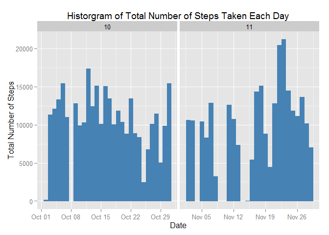
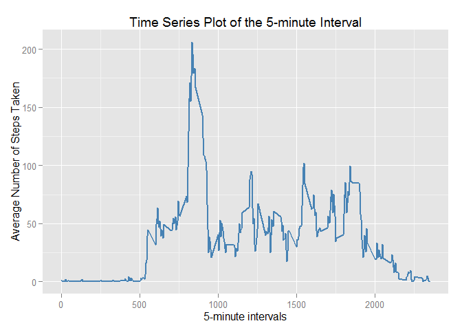
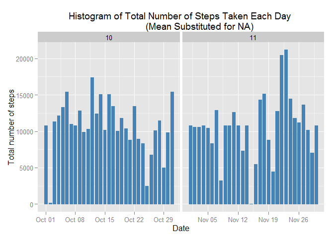

# Reproducible Research: Peer Assessment 1
## Set global options for code viewing and number format

```r
echo = TRUE  # Always make code visible
options(scipen = 1) # Turns off scientific notation
```

================================================================================

## Loading and preprocessing the data

```r
unzip("activity.zip")
data <- read.csv("activity.csv", colClasses = c("integer","Date","factor"))
data$month <- as.numeric(format(data$date, "%m"))
woNA <- na.omit(data) # removes the NA values
rownames(woNA) <- 1:nrow(woNA)
head(woNA)
```

```
##   steps       date interval month
## 1     0 2012-10-02        0    10
## 2     0 2012-10-02        5    10
## 3     0 2012-10-02       10    10
## 4     0 2012-10-02       15    10
## 5     0 2012-10-02       20    10
## 6     0 2012-10-02       25    10
```

```r
dim(woNA)
```

```
## [1] 15264     4
```

```r
library(ggplot2)
```

================================================================================

## What is mean total number of steps taken per day?
Histogram of the total number of steps taken each day


```r
ggplot(
     woNA, 
     aes(date, steps)) + 
     geom_bar(stat = "identity", color="steelblue", fill="steelblue") + 
     facet_grid(. ~ month, scales =  "free") + 
     labs(title = "Historgram of Total Number of Steps Taken Each Day", 
          x = "Date", 
          y = "Total Number of Steps")
```

 

_The mean of the number of steps taken per day is:_

```r
totalSteps <- aggregate(woNA$steps, list(Date = woNA$date), FUN = "sum")$x
mean(totalSteps)
```

```
## [1] 10766.19
```

The mean of the number of steps taken per day is 10766.1886792 steps.

_The median of the number of steps taken per day is:_

```r
median(totalSteps)
```

```
## [1] 10765
```

The median of the number of steps taken per day is 10765 steps.

================================================================================

## What is the average daily activity pattern?
Make a time series plot (i.e. type = "l") of the 5-minute interval (x-axis) 
and the average number of steps taken, averaged across all days (y-axis)


```r
avgSteps <- aggregate(woNA$steps, 
                      list(interval = as.numeric(as.character(woNA$interval))), 
                      FUN = "mean")
names(avgSteps)[2] <- "meanOfSteps"

ggplot(avgSteps, aes(interval, meanOfSteps)) + 
     geom_line(color = "steelblue", size = 0.8) + 
     labs(title = "Time Series Plot of the 5-minute Interval", 
          x = "5-minute intervals", 
          y = "Average Number of Steps Taken")
```

 

Which 5-minute interval, on average across all the days in the dataset, 
contains the maximum number of steps?

```r
avgSteps[avgSteps$meanOfSteps == max(avgSteps$meanOfSteps), ]
```

```
##     interval meanOfSteps
## 104      835    206.1698
```

Interval number 
835 
is the 5-minute interval that contains the maximum number of steps on average.

================================================================================

## Imputing missing values
Calculate and report the total number of missing values in the dataset 
(i.e. the total number of rows with NAs)


```r
sum(is.na(data))
```

```
## [1] 2304
```

_There are 2304 rows with NA values._

-------------------------------------------------------------------------------

Devise a strategy for filling in all of the missing values in the dataset. 
The strategy does not need to be sophisticated. For example, you could use the 
mean/median for that day, or the mean for that 5-minute interval, etc.

Create a new dataset that is equal to the original dataset but with the 
missing data filled in.

_For this exercise, I substituted the mean of the 5-minute interval in place
of NA vales._


```r
newData <- data 
for (i in 1:nrow(newData)) {
    if (is.na(newData$steps[i])) {
        newData$steps[i] <- avgSteps[which(newData$interval[i] == avgSteps$interval), ]$meanOfSteps
    }
}

head(newData)
```

```
##       steps       date interval month
## 1 1.7169811 2012-10-01        0    10
## 2 0.3396226 2012-10-01        5    10
## 3 0.1320755 2012-10-01       10    10
## 4 0.1509434 2012-10-01       15    10
## 5 0.0754717 2012-10-01       20    10
## 6 2.0943396 2012-10-01       25    10
```

```r
sum(is.na(newData)) # checks to see if there are NAs left
```

```
## [1] 0
```

-------------------------------------------------------------------------------

Make a histogram of the total number of steps taken each day and Calculate 
and report the mean and median total number of steps taken per day. 


```r
ggplot(newData, aes(date, steps)) + 
     geom_bar(stat = "identity",
              color = "steelblue",
              fill = "steelblue",
              width = 0.7) + 
     facet_grid(. ~ month, scales = "free") + 
     labs(
          title = "Histogram of Total Number of Steps Taken Each Day 
               (Mean Substituted for NA)", 
          x = "Date", 
          y = "Total number of steps"
          )
```

 

-------------------------------------------------------------------------------

Do these values differ from the estimates from the first part of the assignment?

Mean total number of steps taken per day:

```r
newTotalSteps <- aggregate(newData$steps, 
                           list(Date = newData$date), 
                           FUN = "sum")$x
newMean <- mean(newTotalSteps)
newMean
```

```
## [1] 10766.19
```

_The new mean of the total number of steps taken per day is 10766.1886792 steps._

-------------------------------------------------------------------------------

Median total number of steps taken per day:

```r
newMedian <- median(newTotalSteps)
newMedian
```

```
## [1] 10766.19
```

_The new median of the total number of steps taken per day is 10766.1886792 
steps._

-------------------------------------------------------------------------------

What is the impact of imputing missing data on the estimates of the total daily 
number of steps?


```r
oldMean <- mean(totalSteps)
newMean - oldMean
```

```
## [1] 0
```

_The impact of imputing the missing data on the mean appears to be nothing.  
The mean remains the same._


```r
oldMedian <- median(totalSteps)
newMedian - oldMedian
```

```
## [1] 1.188679
```

_The impact of imputing the missing data on the median is that the imputed
value is higher than excluding the NAs._

================================================================================

## Are there differences in activity patterns between weekdays and weekends?
Create a new factor variable in the dataset with two levels -- 
"weekday" and "weekend" indicating whether a given date is a weekday or 
weekend day.


```r
head(newData)
```

```
##       steps       date interval month
## 1 1.7169811 2012-10-01        0    10
## 2 0.3396226 2012-10-01        5    10
## 3 0.1320755 2012-10-01       10    10
## 4 0.1509434 2012-10-01       15    10
## 5 0.0754717 2012-10-01       20    10
## 6 2.0943396 2012-10-01       25    10
```

```r
newData$weekdays <- factor(format(newData$date, "%A"))
levels(newData$weekdays)
```

```
## [1] "Friday"    "Monday"    "Saturday"  "Sunday"    "Thursday"  "Tuesday"  
## [7] "Wednesday"
```

```r
levels(newData$weekdays) <- list(weekday = c("Monday", 
                                             "Tuesday",
                                             "Wednesday", 
                                             "Thursday", 
                                             "Friday"),
                                 weekend = c("Saturday", 
                                             "Sunday"))
levels(newData$weekdays)
```

```
## [1] "weekday" "weekend"
```

```r
table(newData$weekdays)
```

```
## 
## weekday weekend 
##   12960    4608
```

Make a panel plot containing a time series plot (i.e. type = "l") of the 
5-minute interval (x-axis) and the average number of steps taken, averaged 
across all weekday days or weekend days (y-axis).


```r
avgSteps <- aggregate(newData$steps, 
                      list(interval = as.numeric(as.character(newData$interval)), 
                           weekdays = newData$weekdays),
                      FUN = "mean")
names(avgSteps)[3] <- "meanOfSteps"
library(lattice)
xyplot(avgSteps$meanOfSteps ~ avgSteps$interval | avgSteps$weekdays, 
       layout = c(1, 2), type = "l", 
       xlab = "Interval", ylab = "Number of steps")
```

 

From the graphs, it seems that weekends have a more distributed amount
activity over more intervals than weekdays.  Weekdays have higher spike
activity rating which could be because of a consistent regular activity
at that interval (i.e. walking to the office, going to the gym, etc.).

Weekdays also had a lower level of activity over the span of its intervals
in comparison to weekends which had higher acitivty for most of the
same intervals.  This could be due to lower activity ratings while at work,
versus doing activities on free time (assuming the people had a standard
M-F workweek).
